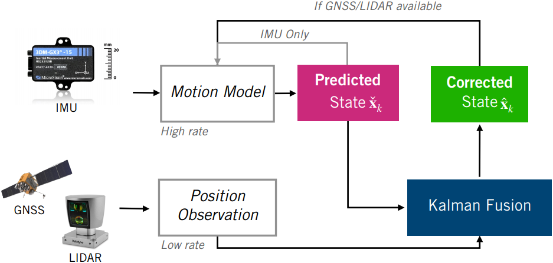
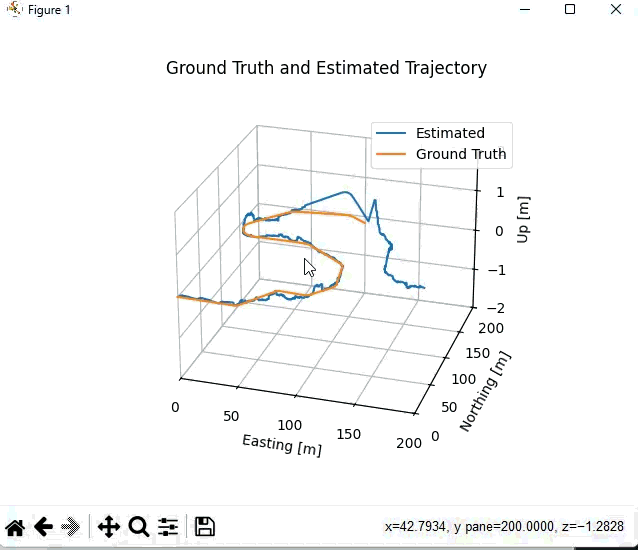

# Vehicle State Estimation on a Roadway

This project implements an Error-State **Extended Kalman Filter (ES-EKF)** to localize a vehicle using data from the [CARLA](https://carla.org/) simulator.  
We fuse high-rate IMU data with GNSS and LIDAR position measurements to estimate position, velocity, and orientation in real-time.

<p align="center">
  
</p>

---

## Table of Contents

- [1. Introduction](#1-introduction)
- [2. ES-EKF Algorithm Overview](#2-es-ekf-algorithm-overview)
- [3. Implementation Details](#3-implementation-details)
  - [3.1. State Initialization](#31-state-initialization)
  - [3.2. Prediction Step](#32-prediction-step)
  - [3.3. Correction Step](#33-correction-step)
- [4. Results](#4-results)
  - [4.1. Trajectory Comparison](#41-trajectory-comparison)
  - [4.2. Estimation Error](#42-estimation-error)
- [5. How to Run](#5-how-to-run)
- [6. References](#6-references)

---

## 1. Introduction

This project is the final programming assignment for the [State Estimation and Localization for Self-Driving Cars](https://www.coursera.org/learn/state-estimation-localization-self-driving-cars?) course from [Coursera](https://www.coursera.org/), using starter code from the University of Toronto.

The **Kalman Filter** algorithm works in two stages:
- **Prediction:** Using the vehicle's motion model and IMU data.
- **Correction:** Using GNSS and LIDAR position measurements.

---

## 2. ES-EKF Algorithm Overview

### State Vector

| Variable       | Description                          | Dimensions         |
| -------------- | ------------------------------------ | ------------------ |
| **$\mathbf{p}$** | Position (E, N, U)                  | 3                  |
| **$\mathbf{v}$** | Velocity (E, N, U)                  | 3                  |
| **$\mathbf{q}$** | Orientation (quaternion)            | 4                  |

**IMU provides:**

| Variable            | Description                           | Dimensions      |
| ------------------- | ------------------------------------- | --------------- |
| **$\mathbf{f}$**    | Specific force (acceleration, body frame) | 3            |
| **$\mathbf{\omega}$** | Angular rate (body frame)               | 3            |

### ES-EKF Pipeline

| Step        | Action                       | Source         | Frequency       |
| ----------- | ---------------------------- | -------------- | --------------- |
| Prediction  | Propagate state & covariance | IMU            | High-rate (Hz)  |
| Correction  | Update state & covariance    | GNSS/LIDAR     | Low-rate (async)|

---

## 3. Implementation Details

### 3.1. State Initialization

```python
p_est = np.zeros([imu_f.data.shape[0], 3])    # Position estimates
v_est = np.zeros([imu_f.data.shape[0], 3])    # Velocity estimates
q_est = np.zeros([imu_f.data.shape[0], 4])    # Orientation (quaternion)
p_cov = np.zeros([imu_f.data.shape[0], 9, 9]) # Covariance matrices

# Set initial values from ground truth
p_est[0] = gt.p[0]
v_est[0] = gt.v[0]
q_est[0] = Quaternion(euler=gt.r[0]).to_numpy()
p_cov[0] = np.zeros(9)
gnss_i  = 0
lidar_i = 0
gnss_t = list(gnss.t)
lidar_t = list(lidar.t)


```


###3.2. Prediction Step
Propagate the state using the motion model and IMU readings:


```python
for k in range(1, imu_f.data.shape[0]):
    delta_t = imu_f.t[k] - imu_f.t[k - 1]

    # 1. Update state with IMU inputs
    q_prev = Quaternion(*q_est[k - 1, :])
    q_curr = Quaternion(axis_angle=(imu_w.data[k - 1]*delta_t))
    c_ns = q_prev.to_mat()
    f_ns = (c_ns @ imu_f.data[k - 1]) + g

    # Predicted state
    p_check = p_est[k - 1, :] + delta_t*v_est[k - 1, :] + 0.5*(delta_t**2)*f_ns
    v_check = v_est[k - 1, :] + delta_t*f_ns
    q_check = q_prev.quat_mult_left(q_curr)

    # 1.1 Linearize the motion model and compute Jacobians
    f_jac = np.eye(9)
    f_jac[0:3, 3:6] = np.eye(3)*delta_t
    f_jac[3:6, 6:9] = -skew_symmetric(c_ns @ imu_f.data[k - 1])*delta_t

    # 2. Propagate uncertainty
    q_cov = np.zeros((6, 6))
    q_cov[0:3, 0:3] = delta_t**2 * np.eye(3)*var_imu_f
    q_cov[3:6, 3:6] = delta_t**2 * np.eye(3)*var_imu_w
    p_cov_check = f_jac @ p_cov[k - 1, :, :] @ f_jac.T + l_jac @ q_cov @ l_jac.T
```


### 3.3. Correction Step
Correct the state when GNSS or LIDAR measurement is available:
``` python
def measurement_update(sensor_var, p_cov_check, y_k, p_check, v_check, q_check):
    # 3.1 Compute Kalman Gain
    r_cov = np.eye(3)*sensor_var
    k_gain = p_cov_check @ h_jac.T @ np.linalg.inv((h_jac @ p_cov_check @ h_jac.T) + r_cov)

    # 3.2 Compute error state
    error_state = k_gain @ (y_k - p_check)

    # 3.3 Correct predicted state
    p_hat = p_check + error_state[0:3]
    v_hat = v_check + error_state[3:6]
    q_hat = Quaternion(axis_angle=error_state[6:9]).quat_mult_left(Quaternion(*q_check))

    # 3.4 Compute corrected covariance
    p_cov_hat = (np.eye(9) - k_gain @ h_jac) @ p_cov_check

    return p_hat, v_hat, q_hat, p_cov_hat

```


Measurement update is triggered as:

``` python
if imu_f.t[k] in gnss_t:
    gnss_i = gnss_t.index(imu_f.t[k])
    p_check, v_check, q_check, p_cov_check = \
        measurement_update(var_gnss, p_cov_check, gnss.data[gnss_i], p_check, v_check, q_check)

if imu_f.t[k] in lidar_t:
    lidar_i = lidar_t.index(imu_f.t[k])
    p_check, v_check, q_check, p_cov_check = \
        measurement_update(var_lidar, p_cov_check, lidar.data[lidar_i], p_check, v_check, q_check)

```


## 4. Results

### 4.1. Trajectory Comparison

Below, the estimated vehicle trajectory (blue) is compared with ground truth (orange).

<p align="center">
  
</p>

### 4.2. Estimation Error

The following plot shows estimation error for each state dimension. Red dashed lines indicate the ±3σ uncertainty bound.

<p align="center">
  
</p>

---

## 5. How to Run

1. **Install dependencies:**
    - Python 3.x
    - `numpy`
    - `matplotlib`
2. **Ensure the data files and images are present and paths are set correctly in `es_ekf.py`.**
3. **Run the script:**
    ```bash
    python es_ekf.py
    ```
   This will generate the trajectory and error plots.

---

## 6. References

- [State Estimation and Localization for Self-Driving Cars (Coursera)](https://www.coursera.org/learn/state-estimation-localization-self-driving-cars)
- [CARLA Simulator](https://carla.org/)
- Starter code by University of Toronto (see `es_ekf.py` and `rotations.py`).

